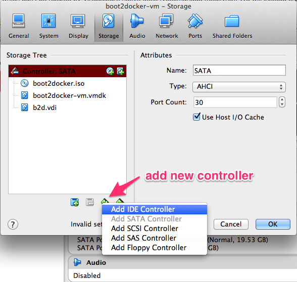
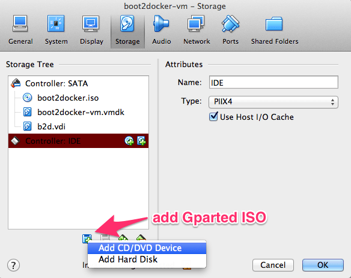
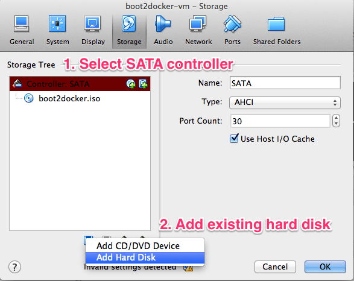
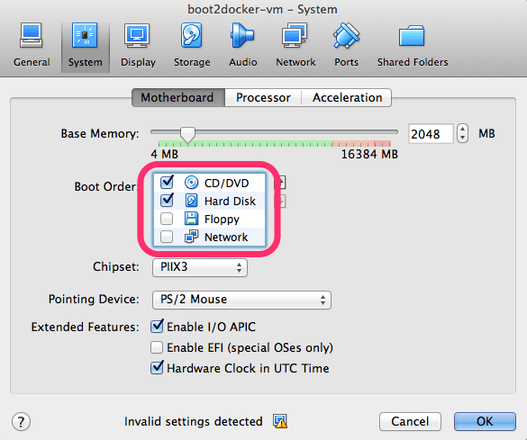
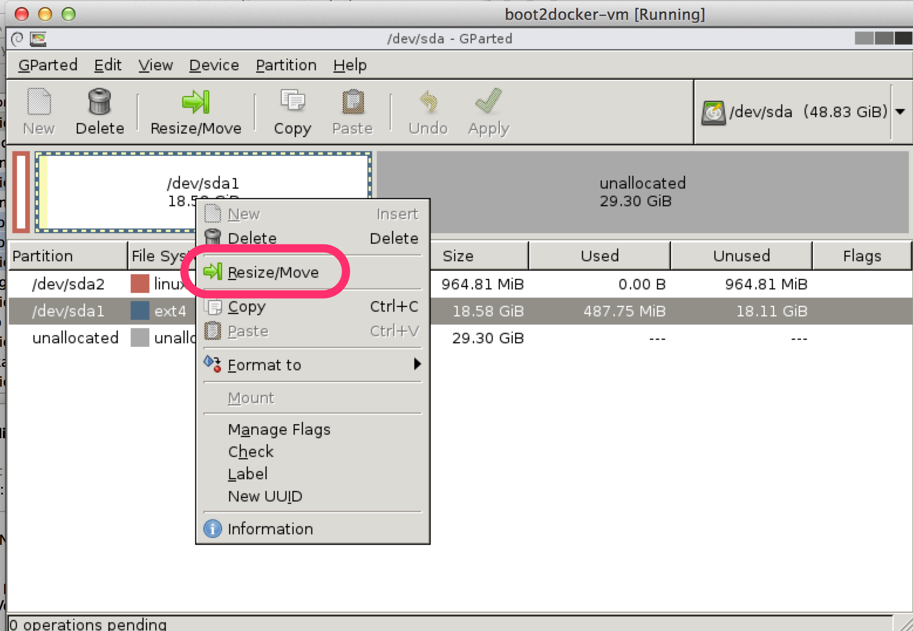
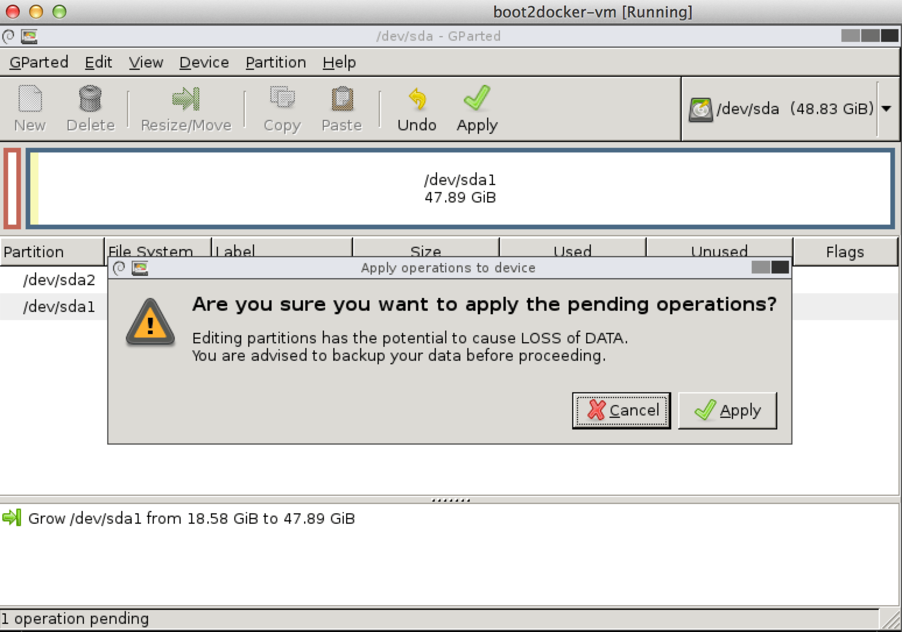

# 出现“no space left on device” 错误怎么办？

如果你使用Boot2Docker创建了许多镜像，或者你使用的镜像非常庞大，你pull时可能会提示“no space left on device”错误。解决办法就是增加一个数据卷挂载，重新规定工具的磁盘部分的大小。

我们推荐[GParted](http://gparted.sourceforge.net/download.php/index.php)。这个工具将作为一个可启动的ISO，它是免费的而且在VirtualBox中工作良好。

1. 停止Boot2Docker

	问题的建议就是先停止Boot2Docker VM，通过命令行：
	
		$ boot2docker stop

2. 克隆VMDK镜像到VDI镜像

	Boot2Docker 挂载的是VMDK镜像，不可能重新规定大小。我们将替换为VDI镜像，创建VDI镜像并克隆VMDK镜像到VDI镜像中。

	使用VirtualBox命令行工具，克隆VMDK镜像到VDI镜像中：

		$ vboxmanage clonehd /full/path/to/boot2docker-hd.vmdk /full/path/to/<newVDIimage>.vdi --format VDI --variant Standard

3. 重新修改VDI镜像大小

	选择你需要的合适大小。如果你将要挂载很多容器或者你的容器非常的大或者更大：

		$ vboxmanage modifyhd /full/path/to/<newVDIimage>.vdi --resize <size in MB>

4. 下载磁盘分割工具ISO

	为了重新修改数据卷的大小，我们将使用[GParted](http://gparted.sourceforge.net/download.php/index.php)。一旦你下载完这个工具，添加ISO到Boot2Docker VM IDE bus。你可能需要创建这个bus以便添加这个ISO。

	> 说明：你选择分割工具是重要的，ISO是一种可以挂在并启动的有效工具。

	
	

5. 添加一个新的VDI镜像

	在VirtualBox里的Boot2Docker镜像上的设置，移除VMDK镜像从SATA控制，添加VDI镜像。

	

6. 确认启动顺序

	在Boot2Docker VM的系统设置中，确保CD/DVD是第一个启动项。

	

7. 启动磁盘分割ISO

	手动启动Boot2Docker VM和磁盘分割ISO。使用GParted，选择GParted Live (default settings) 参数。选择默认的键盘，语言和XWindows设置，GParted 工具将启动和显示你创建的VDI数据卷。在VDI上右键选择 **Resize/Move** 。

	

	拖拽slider显示数据卷到最大大小，点击**Resize/Move**，然后**应用**。
	
	
	
	退出GParted然后关闭掉VM。移除GParted ISO从IDE控制器。

8. 启动Boot2Docker VM

	手动启动Boot2Docker。VM自动显示日志，但是如果它没有，这个认证证书是在docker/tcuser下的。使用df -h命令，确认你的修改生效了。