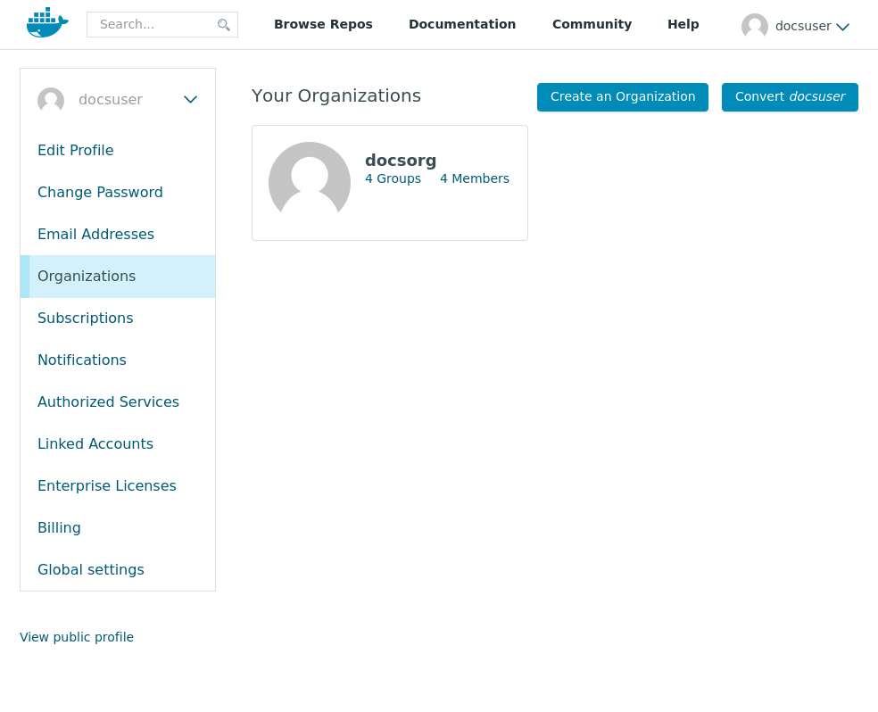
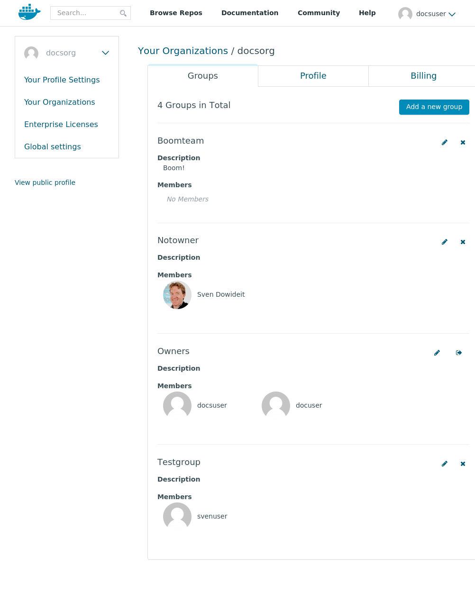
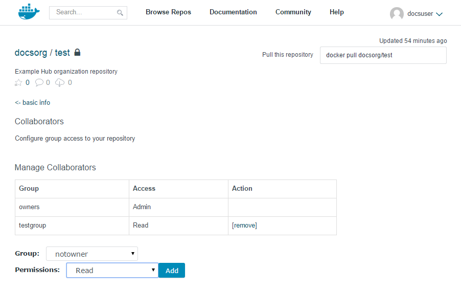

# Docker Hub账户

## Docker Hub 账户

在Docker Hub上，你可以在没有账户或者签名的情况下，`search`镜像并`pull`它们。但是，如果要push镜像，被评论或者被评星的话，你需要一个Docker Hub账户。

### 注册Docker Hub账户

你可以注册[Docker Hub](https://hub.docker.com/)账户，在[注册页面](https://hub.docker.com/account/signup/)。一个有效的Email地址是需要用来注册、激活账户的。

### Email激活操作

你需要有一个尽快地去邮件认证并使用Docker Hub账户。如果你没有发现认证Email，你可以要求再一次访问[重发Email确认页面](https://hub.docker.com/account/resend-email-confirmation/)

### 密码重置操作

如果你不能登录你的账户，你需要[重置密码](https://hub.docker.com/account/forgot-password/)。

## Organizations & Groups

一个Docker Hub组织包含公有的和私有的仓库，就想一个用户账号一样。组织(Organizations)具有创建、pull、push镜像到自己的仓库的权限。这样的权限被分配给自定义的用户组(Groups)，然后分配组权限到指定的仓库。这允许你可以指定受限的操作的docker镜像，选择哪个具有发布新镜像的Docker Hub用户。

### 创建和查看组织

你会在Account Settings下，看到[组织(Organizations)](https://hub.docker.com/account/organizations/)。

### Organization groups

在组织下的Owners组(Groups)的用户，具有创建和修改所有组的用户。如果他们不是组织的Owner（拥有者）,用户仅仅可以看到他们的成员结构。

### 组的仓库管理权限

使用组织的组来管理谁对你的仓库负责。

你需要成为一个组织Owners组(Groups)的用户，才能创建一个新的组，Hub仓库或者自动构建等功能。作为一个Owner，你会代理分配如下仓库操作权限给特定组。

1. 读权限： 允许组用户查看、search和pull一个私有仓库或公有仓库。

2. 写权限：允许组用户push非自动化构建的仓库到Docker Hub。

3. 管理员权限：允许组用户修改仓库的"Description", "Collaborators", "Mark as unlisted", "Public/Private" status 和 "Delete"。

> 说明:一个用户没有验证Email将仅有对仓库读的权限，不管你给定他们组的权限是什么。

