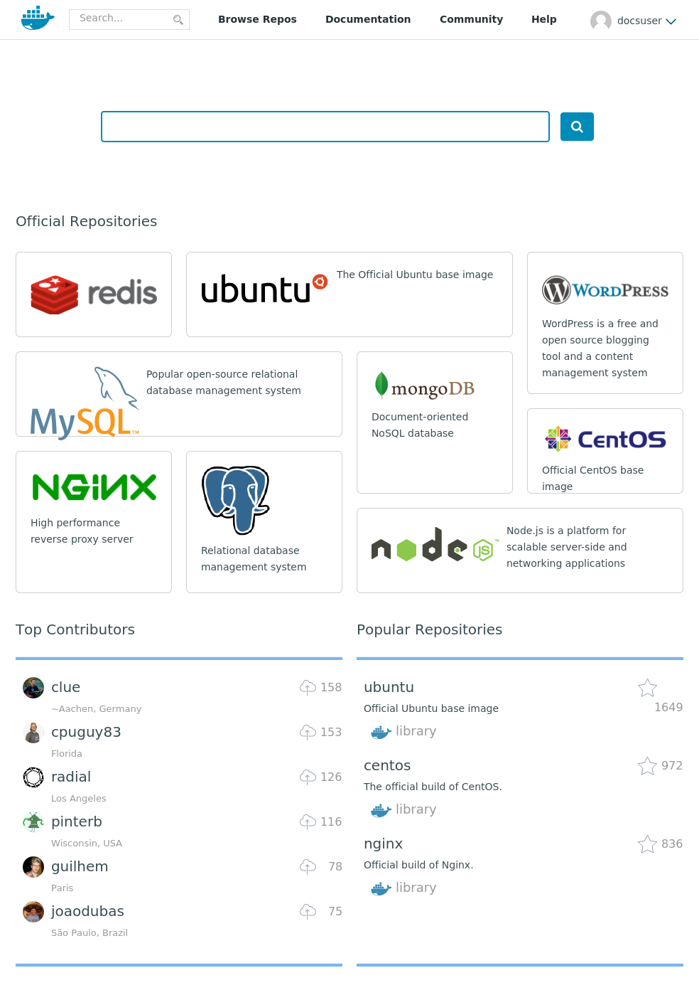

# Docker Hub用户指南

Docker Hub可以用来查找、pull 镜像并运行或者构建镜像，可以发布或者构建其它用户所使用的镜像。

## 查找仓库和镜像

有两种方式搜索公有仓库和镜像。你可以使用Docker Hub Search工具或者使用Docker命令行工具：

	$ docker search ubuntu

两种方式都将显示当前有效的公有仓库。

如果仓库是私有的或者被标记不被列举，这将都不会在搜索的结果中。为了看到所有的仓库（你得有权限）和状态，你可以看你的[个人信息页](https://hub.docker.com/)。

## pull、运行和构建镜像

你可以了解[更多信息](../Userguide/dockerimages.md)。

## 官方仓库

Docker Hub包含了许多[官方仓库](http://registry.hub.docker.com/official)。有Docker贡献者或者供应商认证的仓库。包含来自供应商的docker镜像，例如：Canonical, Oracle, 和 Red Hat ，你可以使用来构建应用或者服务。

如果你使用官方仓库，你需要知道你使用一个最佳或者更新的镜像来应用到你的应用中。

> 说明：如果你喜欢共享一个官方的仓库，请阅读[官方仓库]()了解更多信息。

## 构建和传送你自己的仓库和镜像

Docker Hub提供给你和你的团队放置构建和传送的Docker镜像。

Docker镜像的集合都使用仓库管理。

你可以配置两种仓库管理的类型：

1. 仓库：允许你push镜像到Hub，从你本地Docker daemon。
2. 自动构建：允许你配置Github或者Bitbucket来触发重构仓库，当这些仓库修改时。