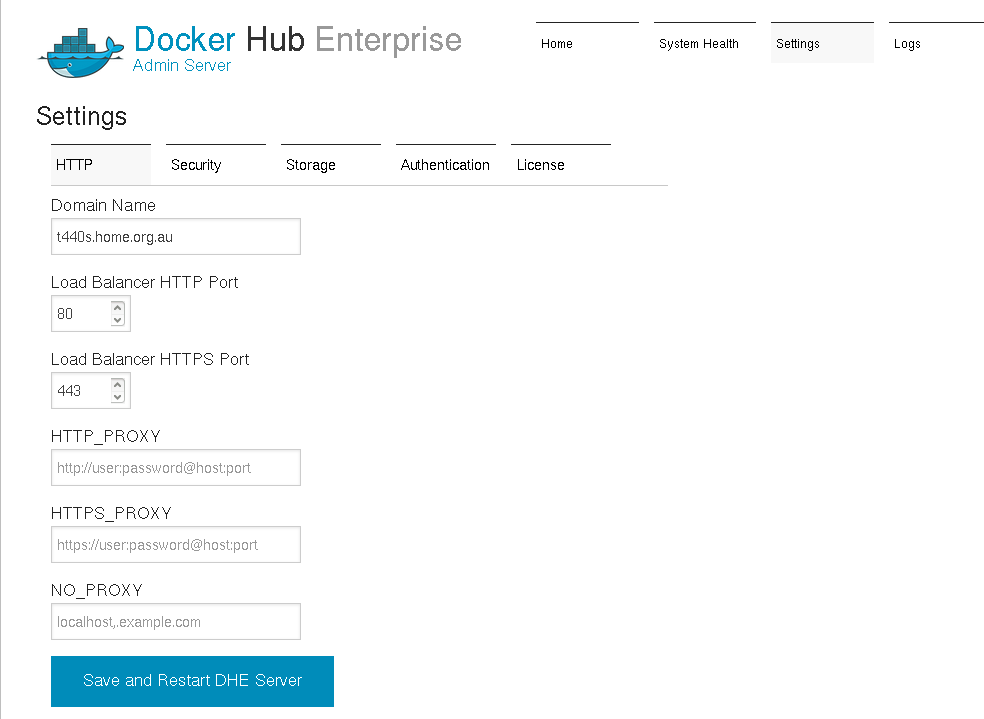
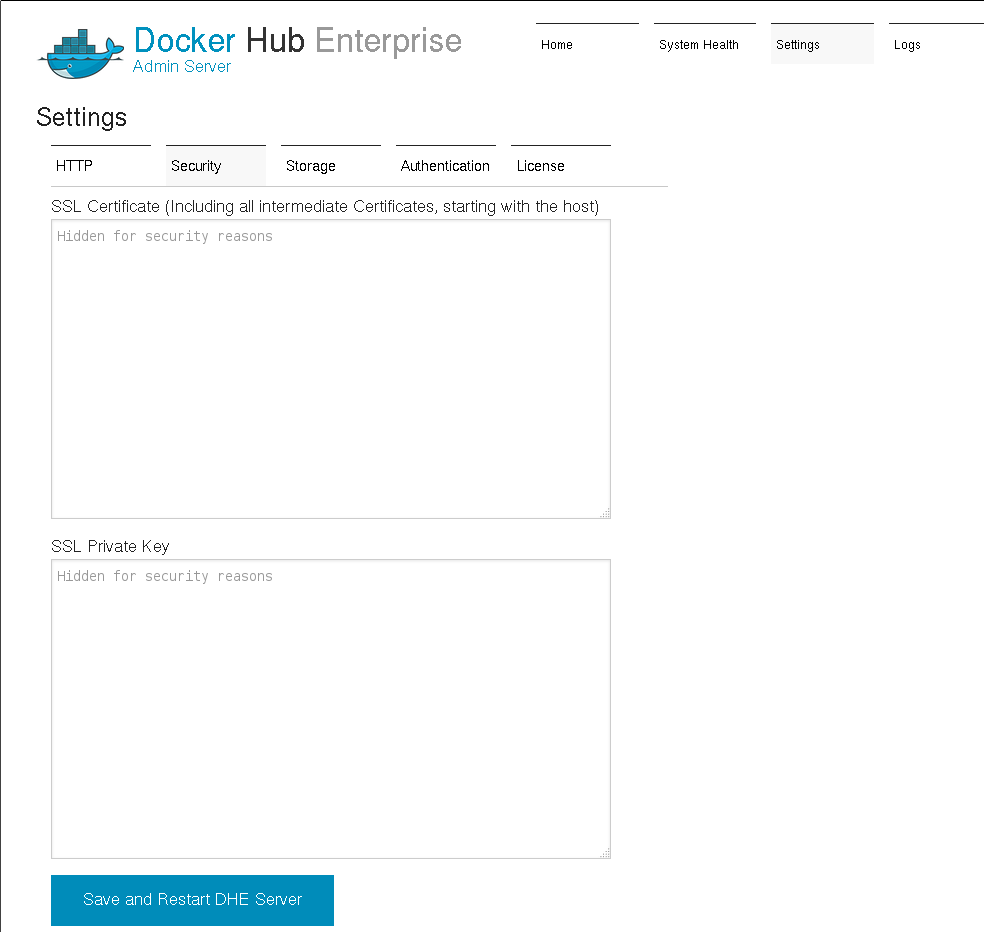

# 配置 DHE

## 概述

本文将帮助你适当配置你的DHE，以让它可以运行在你的环境中。浏览器加载你的DHE，点击"Settings"页，查看配置参数。你抗看到如下配置参数：

- Domains and ports
- Security settings
- Storage settings
- Authentication settings
- Your DHE license

## Domains and ports

Domain Name: required defaults to an empty string, the fully qualified domain name assigned to the DHE host.

Load Balancer HTTP Port: defaults to 80, used as the entry point for the image storage service. To see load balancer status, you can query http://<dhe-host>/load_balancer_status.

Load Balancer HTTPS Port: defaults to 443, used as the secure entry point for the image storage service.

HTTP_PROXY: defaults to an empty string, proxy server for HTTP requests.

HTTPS_PROXY: defaults to an empty string, proxy server for HTTPS requests.
NO_PROXY: defaults to an empty string, proxy bypass for HTTP and HTTPS requests.

> 说明：如果你需要DHE重新生成自签的证书，你将需要先删除`/usr/local/etc/dhe/ssl/server.pem`文件，让后重启DHE容器，通过修改并保存 "Domain Name"或者使用`bash -c "$(docker run dockerhubenterprise/manager restart)"`。

##　Security（安全）

SSL Certificate: Used to enter the hash (string) from the SSL Certificate. This cert must be accompanied by its private key, entered below.

Private Key: The hash from the private key associated with the provided SSL Certificate (as a standard x509 key pair).

为了运行，DHE要求使用HTTPS/SSL进行编码在DHE私有库和你的Docker Engine之间通信，以及DHE私有库和你的DHE网页浏览器、DHE管理员服务之间。这里有一些配置参数：

- You can use the self-signed certificate DHE generates by default.
- You can generate your own certificates using a public service or your enterprise's infrastructure. See the Generating SSL certificates section for the options available.

如果你生成你自己的证书，你可以安全他们，通过如下的命令[添加你自己的私有库证书到DHE](https://docs.docker.com/docker-hub-enterprise/configuration/#adding-your-own-registry-certificates-to-dhe)。

另一方面，如果选择使用DHE生成的证书，或者你自己生成的证书在你的Docker host上的client不受信任，你将需要作如下的步骤：

- Install a registry certificate on all of your client Docker daemons,

- Set your client Docker daemons to run with an unconfirmed connection to the registry.

###　生成SSL证书

### 添加自己的私有库证书到DHE

###　安装私有库证书到Docker daemons客户端

### 如果你不安装证书

### Boot2Docker

## 镜像存储配置

## 权限认证

###　没有权限认证

###　基本的权限认证

###　LDAP 权限认证

##　下一步

为了了解更多DHE支持的信息，请阅读[DHE支持](support.md)