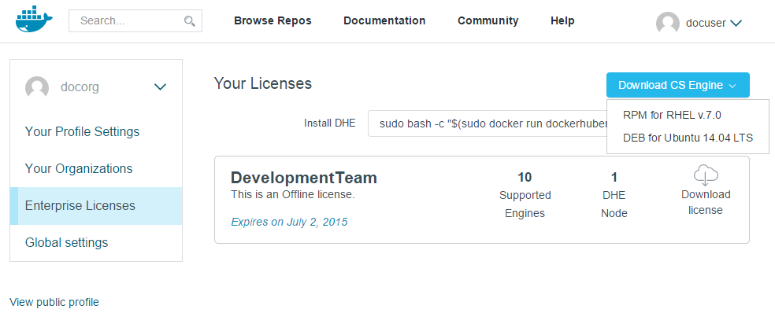
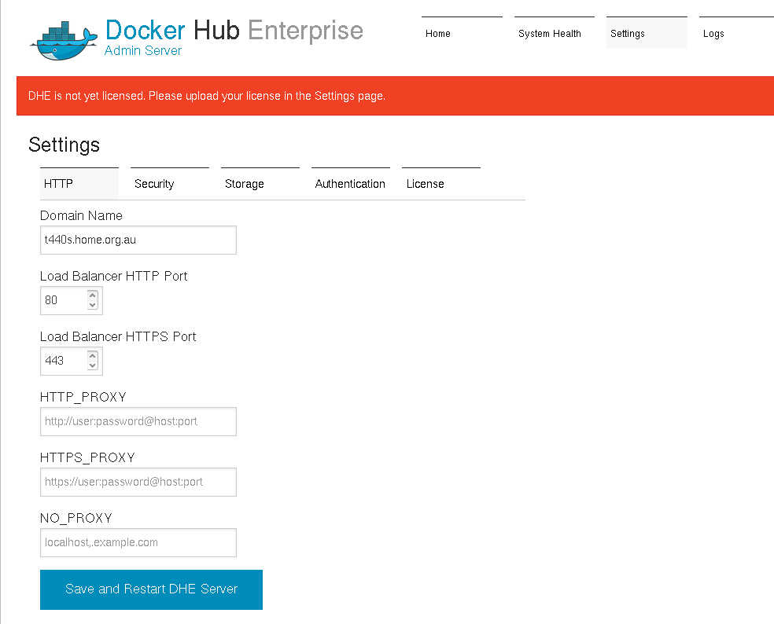
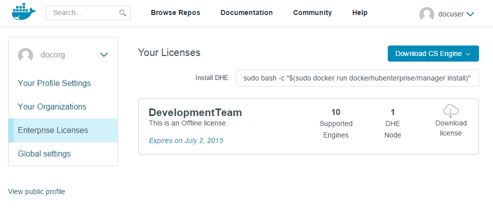
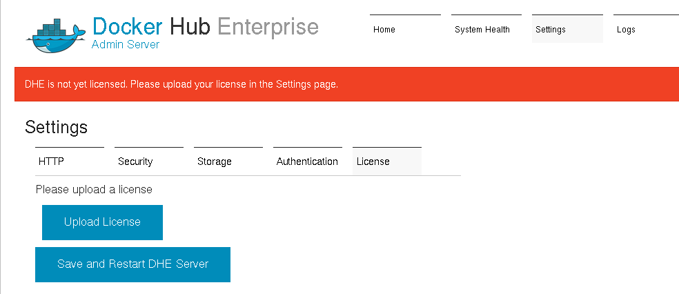

# 安装Docker Hub Enterprise

## 概述

本文描述了获取、安装并安全运行Docker Hub Enterprise (DHE)。DHE是通过Docker 容器安装的。一旦安装，你将需要选择一个安全运行它的方式。本文将解释你做安全设置需要的参数以及根据你选择的安全方式发现需要配置它的相关资源。更多更详细的信息可以在[DHE配置](configuration.md)章节了解到。

特别地，安装要求需要如下几步，依次是：

1. 获取license，通过购买DHE或者索要一个试验license。
2.安装商业版Docker Engine。
3.安装DHE
4.添加你的license到你的DHE实例。

## License

为了运行DHE，你将需要获得License，或者购买DHE或者索要一个试验license。这个License将关联到你的Docker Hub账号或者Docker Hub组织（所以如果你没有一个账号，你将需要配置一个账号，这个在待会获取license时也需要做相同的事情）。为了得到你的License或者开启一个试验License，请联系我们的[销售部门](sales@docker.com)。你的购买或者要求完成，你将接受到一个含有远端指令的License的邮件。

## 预备条件

DHE 1.0.1要求如下：

* 商业支持的Docker Engine 1.6.1或者更新版本，运行在Ubuntu 14.04 LTS、RHEL7.1 或者RHEL7.0的主机上。（稍后会讲解怎样安装商业支持的Docker Engine）。

> 说明：为了保证你服从DHE支持协议，你必须使用当前商业支持的Docker Engine。运行普通的开源的Docker Engine是不支持的。

* 你的Docker daemon需要使用Unix socket（默认情况）监听，以此它可以绑定到DHE管理容器，允许DHE管理容器本身和它的更新。为此，你的DHE主机将需要联网以便它可以获取更新。

* 你的主机需要有TCP端口80和443访问DHE容器的端口映射。

* 你也将需要Docker Hub用户名和密码获取DHE license。（或者Docker Hub组织的管理员的用户名获取DHE license）。

## 安装商业支持的Docker Engine

自从DHE使用Docker 安装，商业支持的Docker Engine必须要首先被安装。这样做会得到一个RPM或者DEB私有库，你使用BASH脚本从Docker Hub下载并安装。

###　下载商业支持的Docker Engine安装脚本

为了下载商业支持的Docker Engine安装脚本，登录Docker hub用户名获得你的license。一旦你登录，访问"[商业License](https://registry.hub.docker.com/account/licenses/)"页面在你的Docker Hub账号的settings选项里。

选择你准备好的主机的操作系统，从Download CS Engine下来选项中选择，一旦Bash启动脚本被下载，接下来的步骤根据你选择的操作系统略有不同。

### RHEL 7.0/7.1安装

首先，复制下载好的BASH安装脚本到你的RHEL主机。接下来，运行如下命令安装商业支持的Docker Engine和它的依赖包，并启动Docker daemon。
	
	$ sudo yum update && sudo yum upgrade
	$ chmod 755 docker-cs-engine-rpm.sh
	$ sudo ./docker-cs-engine-rpm.sh
	$ sudo yum install docker-engine-cs
	$ sudo systemctl enable docker.service
	$ sudo systemctl start docker.service

为了简化使用Docker，你可以获得非sudo权限的Docker socket通过添加你的用户到`docker group`，然后登出在登入。
	
	$ sudo usermod -a -G docker $USER
	$ exit

> 说明：你可能需要重新启动你的服务器更新RHEL内核包。

### Ubuntu14.04 LTS 安装

首先，复制下载好的BASH安装脚本到你的RHEL主机。接下来，运行如下命令安装商业支持的Docker Engine和它的依赖包。
	
	$ sudo apt-get update && sudo apt-get upgrade
	$ chmod 755 docker-cs-engine-deb.sh
	$ sudo ./docker-cs-engine-deb.sh
	$ sudo apt-get install docker-engine-cs

稍后，指定Docker运行使用命令`sudo service docker start`。

为了简化使用Docker，你可以获得非sudo权限的Docker socket通过添加你的用户到`docker group`，然后登出在登入。
	
	$ sudo usermod -a -G docker $USER
	$ exit

> 说明：你可能需要重新启动你的服务器更新LTS内核包。

##　更新商业支持的Docker Engine

CS Docker Engine 1.6.1 解决了一些安全缺陷，客户需要立马更新。

> 说明：如果你有安装CS Docker Engine 1.6.1 ，它必须更新；同样的，因为兼容性问题，[DHE必须立刻更新](https://docs.docker.com/docker-hub-enterprise/install/#upgrading-docker-hub-enterprise)。

 CS Docker Engine安装脚本安装RHEL/Ubuntu软件包，以此更新 CS Docker Engine要求你运行update命令。

###　RHEL 7.0/7.1 更新

为了更新 CS Docker Engine,运行如下命令:

    $ sudo yum update
    $ sudo systemctl daemon-reload && sudo systemctl restart docker

###　Ubuntu 14.04 LTS 更新

为了更新 CS Docker Engine,运行如下命令:

   	$ sudo apt-get update && sudo apt-get dist-upgrade docker-engine-cs

## 安装 Docker Hub Enterprise

一旦商业支持的Docker Engine被安装上，你可以安装DHE了。DHE是一个自安装的应用，使用Docker和Docker Hub 构建和发布。它需要重新启动并配置，使用Docker socket绑定到挂在它的容器上。

启动安装DHE通过运行dockerhubenterprise/manager容器。

	$ sudo bash -c "$(sudo docker run dockerhubenterprise/manager install)"

> 说明：在dockerhubenterprise/manager命令中sudo需要，为了安全确保Bash脚本有访问Docker host的权限。

你也可以发现这些命令"Enterprise Licenses"章节（你的 Hub user profile）。这些命令将启动一个shell脚本，创建需要的目录，然后运行Docker 来pull DHE镜像并运行它的容器。

依赖你的网络链接，这个过程可能会花费数分钟才能完成。

一个成功的安装将pull一个很大数量的Docker Images，应该可以看到如下的命令行输出：

	$ sudo bash -c "$(sudo docker run dockerhubenterprise/manager install)"
	Unable to find image 'dockerhubenterprise/manager:latest' locally
	Pulling repository dockerhubenterprise/manager
	c46d58daad7d: Pulling image (latest) from dockerhubenterprise/manager
	c46d58daad7d: Pulling image (latest) from dockerhubenterprise/manager
	c46d58daad7d: Pulling dependent layers
	511136ea3c5a: Download complete
	fa4fd76b09ce: Pulling metadata
	fa4fd76b09ce: Pulling fs layer
	ff2996b1faed: Download complete
	...
	fd7612809d57: Pulling metadata
	fd7612809d57: Pulling fs layer
	fd7612809d57: Download complete
	c46d58daad7d: Pulling metadata
	c46d58daad7d: Pulling fs layer
	c46d58daad7d: Download complete
	c46d58daad7d: Download complete
	Status: Downloaded newer image for dockerhubenterprise/manager:latest
	Unable to find image 'dockerhubenterprise/manager:1.0.0_8ce62a61e058' locally
	Pulling repository dockerhubenterprise/manager
	c46d58daad7d: Download complete
	511136ea3c5a: Download complete
	fa4fd76b09ce: Download complete
	1c8294cc5160: Download complete
	117ee323aaa9: Download complete
	2d24f826cb16: Download complete
	33bfc1956932: Download complete
	48f0dd6c9414: Download complete
	65c30f72ecb2: Download complete
	d4b29764d0d3: Download complete
	5654f4fe5384: Download complete
	9b9faa6ecd11: Download complete
	0c275f56ca5c: Download complete
	ff2996b1faed: Download complete
	fd7612809d57: Download complete
	Status: Image is up to date for dockerhubenterprise/manager:1.0.0_8ce62a61e058
	INFO  [1.0.0_8ce62a61e058] Attempting to connect to docker engine dockerHost="unix:///var/run/docker.sock"
	INFO  [1.0.0_8ce62a61e058] Running install command
	<...output truncated...>
	Creating container docker_hub_enterprise_load_balancer with docker daemon unix:///var/run/docker.sock
	Starting container docker_hub_enterprise_load_balancer with docker daemon unix:///var/run/docker.sock
	Bringing up docker_hub_enterprise_log_aggregator.
	Creating container docker_hub_enterprise_log_aggregator with docker daemon unix:///var/run/docker.sock
	Starting container docker_hub_enterprise_log_aggregator with docker daemon unix:///var/run/docker.sock
	$ docker ps
	CONTAINER ID        IMAGE                                                   COMMAND                CREATED             STATUS         PORTS                                      NAMES
	0168f37b6221        dockerhubenterprise/log-aggregator:1.0.0_8ce62a61e058   "log-aggregator"       4 seconds ago       Up 4 seconds                                              docker_hub_enterprise_log_aggregator
	b51c73bebe8b        dockerhubenterprise/nginx:1.0.0_8ce62a61e058            "nginxWatcher"         4 seconds ago       Up 4 seconds   0.0.0.0:80->80/tcp, 0.0.0.0:443->443/tcp   docker_hub_enterprise_load_balancer
	e8327864356b        dockerhubenterprise/admin-server:1.0.0_8ce62a61e058     "server"               5 seconds ago       Up 5 seconds   80/tcp                                     docker_hub_enterprise_admin_server
	52885a6e830a        dockerhubenterprise/auth_server:alpha-a5a2af8a555e      "garant --authorizat   6 seconds ago       Up 5 seconds   8080/tcp

一旦这些过程完成，你需要管理和配置你的DHE实例通过你的浏览器https://<host-ip>/。

你的浏览器将警告你这是一个不安全的网站，带有自签或者不信任的证书。这是正常的预料的到的，临时允许这样的链接。

### 设置DHE域名

DHE管理员站点将警告 "Domain Name" 没有设置。访问"Settings"设置"Domain Name"到你的DHE服务器。点击 "Save and Restart DHE Server" 按钮将生成一个新的证书，这个证书稍后会在 DHE Administrator 网页或者DHE Registry服务器上使用。

随着服务的重启，你将被允许链接非信任的DHE web admin站点。

最后，你将看到一个警告信息，你安装的DHE是没有证书的。你将确保你完成接下来的一步。

### 添加你的License

DHE私有库服务将不能启动知道你添加了你的license。为此，你将首先下载你的license从Docker Hub，稍后上传它到你的DHE web admin 服务上。如下面这几步：

1. 如果需要，回退到docker hub，使用你刚才使用的用户名，然后获取你的license。进入"Settings"到你的账号设置页面，然后点击"Enterprise Licenses" 。
2. 你将看到一个有效的license。点击下载按钮获取license文件。

3. 接下来，访问DHE实例在你的浏览器中，点击"Settings">"License"> "Upload license file"。这将打开一个标准文件浏览器。定位并选择你的license（在第2步中下载的）。同意选择并关闭选择文件对话框。

4. 点击"Save and Restart DHE"按钮，这将停止DHE然后重启它，注册新的license。
5. 核实是否还被要求 "unlicensed copy"警告。

### 安全的DHE

安全的DHE是被要求的，当你从DHE push或者pull时，你需要安全性考虑。

这里有数个方式以确保安全访问。了解更多信息，查看[用户指南-安全配置DHE](https://docs.docker.com/docker-hub-enterprise/configuration/#security)小结。

###　使用DHE push pull镜像

现在，你有配置好 "Domain Name"的DHE，以及具有安全配置的Docker daemon。你可以测试你的安装通过[使用DHE push pull镜像](https://docs.docker.com/docker-hub-enterprise/userguide/#using-dhe-to-push-and-pull-images)章节的介绍。

### DHE网页页面以及私有库权限

默认情况下，没有安全设置在DHE web admin页面，或者 DHE registry。你可以限定权限使用一个DHE配置的一些列用户名和密码，或者你可以配置DHE来使用LDAP-基本的权限。

查看[DHE权限设定](https://docs.docker.com/docker-hub-enterprise/configuration/#authentication)了解更多信息。

##　更新Docker Hub Enterprise

DHE允许有计划的在线更新。启动点击"System Health" ，你将看到当前安装的版本`Current Version: 0.1.12345`。

如果你的DHE实例是最新的，也将看到消息"System Up to Date."

如果有一个更新有效，你将看到信息 "System Update Available!"，旁边有个按钮"Update to Version X.XX"。为了更新，DHE将pull最新的DHE容器镜像从Docker Hub。如果你没有准备链接到Docker Hub，DHE将先让你登录。

更新程序需要一定的下载时间，为了完成更新，DHE将链接到Docker Hub pull最新的DHE容器镜像。部署这些容器，关闭原来老的容器（Resolve any necessary links/urls）。

假设你有一个相当好的网络链接，全部更新操作就需要在数分钟内完成。

现在，还不赶紧[更新CS Docker Engine](https://docs.docker.com/docker-hub-enterprise/install/#upgrading-the-commercially-supported-docker-engine)。

> 说明：如果Docker engine首先更新，DHE可以通过如下命令行更新：`sudo bash -c "$(sudo docker run dockerhubenterprise/manager:1.0.0 upgrade 1.0.1)"`

## 下一步

为了了解更多关于配置DHE的信息，请阅读[配置DHE](configuration.md)章节。