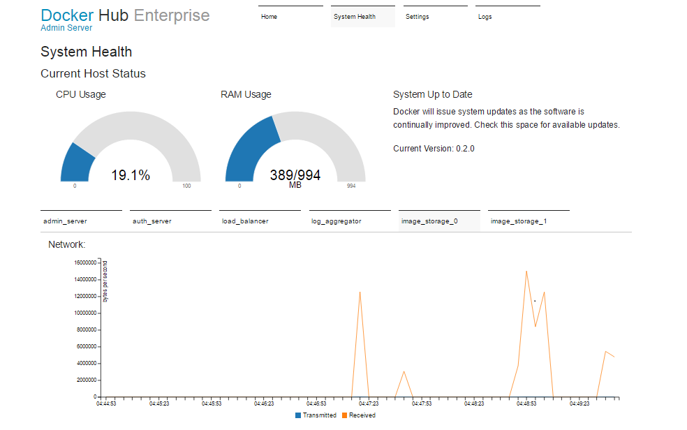
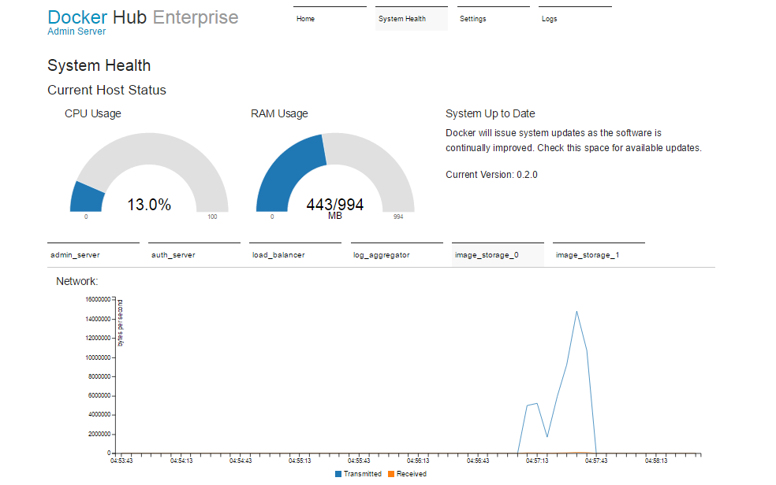
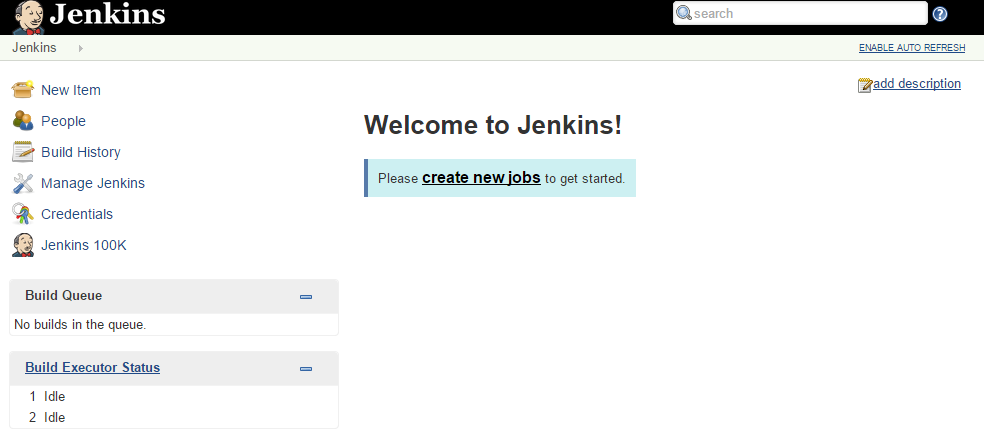
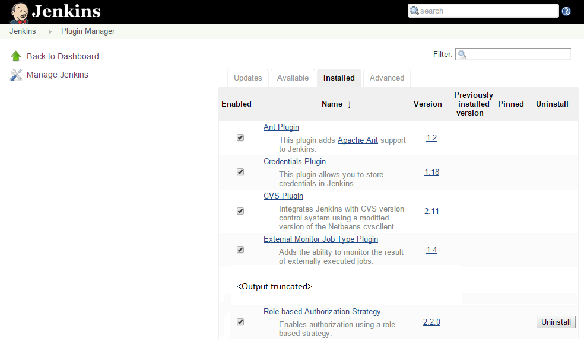

# DHE快速开始：基本用户工作流程

## 概述

快速指南将让你有一个对使用DHE大致的了解，Docker以镜像存储为前提的应用。本次，将告诉你通过使用DHE完成一个典型的、构建一个生产环境管道的部分：配置一个Jenkins 实例。一旦你完成该任务，你应该有一个对DHE怎样工作以及怎样使用它对你有用有了一个大致的了解。

特别的，本指南展示了一个检索官方Jenkins Docker镜像的过程，定制该镜像直到符合你的要求，并放置到你企业防火墙环境中的私有DHE私有实例。你的开发者将可以检索到订制的Jenkins镜像，使用构建的CI/CD设施针对你们的项目，不在让他们工作在labtop、VM或者云提供者的平台上了。
本指南将告诉你通过如下的步骤：

1. Pull官方Jenkin镜像从Docker Hub。
2. 根据你的需要，定制Jenkins镜像。
3. Push定制的镜像到DHE。
4. pull定制的镜像从DHE。
5. 使用定制镜像启动容器。
6. 使用新的Jenkins容器。

你可能完成了指南在剪短的三十分钟左右。

> 说明：本指南假设你安装了一个可工作的DHE实例，并可以通过dhe.yourdomain.com访问得到。如果需要获得安装和配置DHE的信息，请阅读[安装DHE](install.md)章节。

## Pull官方Jenkin镜像

> 说明：本指南假设你熟知Docker的基本概念，例如镜像，容器和镜像仓库。如果你需要了解更多关于Docker的基本原理，请阅读[Docker用户指南](../UserGuid/userguid.md)章节。

首先，你将检索官方Jenkin镜像从DockerHub。默认地，如果docker没有在本地发现镜像，它将试图pull镜像从Docker Hub。在你的网络上，从CLI的一台机器上运行Docker引擎，使用docker pull命令 pull官方Jenkin镜像。

	$ docker pull jenkins

> 说明：本指南假设你可以运行Docker命令，从一台有docker group成员或者有root权限的机器上。或者，你可以使用sudo在实例命令的前边（这里说的就是如果没有修改默认权限，需要加入sudo，详细请阅读相应文章）。

Docker将启动pull镜像的进程。一旦它完成，Jenkins镜像可以通过docker images命令查看得到。

	$ docker images
	REPOSITORY  TAG     IMAGE ID      CREATED      VIRTUAL SIZE
	jenkins     latest  1a7cc22b0ee9  6 days ago   662 MB

> 说明：因为pull命令没有指定任何tag，它将pull Jenkin镜像的 latest版本。如果你的企业环境要求你使用指定的版本，添加tag获取你需要的版本（例如：jenkins:1.565）。

## 定制Jenkins镜像

现在你有一个本地可以复制的Jenkins镜像，你将定制它，以致可以整合构建到你的设备上。为了做到这一点，你将创建一个定制的Docker镜像，添加Jenkins插件，以便提供友好的用户管理。你也将配置Jenkins以让它达到安全要求，通过禁用掉http，强制使用https。你将使用Dockerfile和docker build命令，来实现这一切。

> 说明：这正好是明显修改和配置Jenkins的实例。免费试探在你的环境中，怎样添加或者替换哪些配置项的Jenkins才是适合的。

### 创建一个build上下文

为了添加新的插件，以此能配置HTTPS权限的定制Jenkins镜像，你需要作如下操作：

1. 创建文本文件，定义新的插件。
2. 创建一个私有key和证书的副本。

所有如上的这些文件需要在你稍后会创建的Dockerfile在相同的目录。

1. 创建一个build目录并进入：

	$ mkdir build && cd build

在这个目录里，创建一个新的文件叫做plugins，并添加如下行：

	role-strategy:2.2.0

（上边使用的插件的版本，在写本指南的时候是最新的。）

1. 你也需要复制服务器的私有key和证书。获得如下名称的副本：https.key和https.pem。

> 说明：因为创建新的keys序列以能在广大的平台或设备上使用，本指南没有覆盖key生成。我们假设你有权限保留现存的keys。如果没有权限或者没有生成你自己的keys，尽情跳过https配置这一步。本指南将带你直接构建只一个定制的Jenkins镜像并使用DHE push、pull镜像。

### 创建Dockerfile

和plugins、私有key和证书的相同的目录下，创建一个新的Dockerfile，写入如下内容：

	 FROM jenkins

	 #New plugins must be placed in the plugins file
	 COPY plugins /usr/share/jenkins/plugins
	
	 #The plugins.sh script will install new plugins
	 RUN /usr/local/bin/plugins.sh /usr/share/jenkins/plugins
	
	 #Copy private key and cert to image
	 COPY https.pem /var/lib/jenkins/cert
	 COPY https.key /var/lib/jenkins/pk
	
	 #Configure HTTP off and HTTPS on, using port 1973
	 ENV JENKINS_OPTS --httpPort=-1 --httpsPort=1973 --httpsCertificate=/var/lib/jenkins/cert --httpsPrivateKey=/var/lib/jenkins/pk

第一个COPY命令将复制plugins文件到定制的镜像的/usr/share/jenkins目录下。

RUN命令将执行/usr/local/bin/plugins.sh脚本，以复制新近复制的plugins文件，并将安装文件中列举的插件。

接下来的两个COPY命令复制服务器的私有key和证书到新镜像的指定的目录下。

ENV命令在镜像中创建一个JENKINS_OPT的环境变量。这个环境变量将会呈现到通过镜像启动的容器中，并包含告诉Jenkins禁用掉HTTP并启用HTTPS功能所要求的配置。

> 说明：你可以通过JENKINS_OPT 环境变量指定一个有效的端口，在例子中的值1973只是任意的。

Dockerfile，plugins以及私有key和证书，必须要在相同的目录下，因为docker build命令使用这个包含Dockerfile的目录作为其构建的上下文(`build context`)。仅有这些文件作为上下文，将全部包含在将被构建的镜像中。

### 构建你的定制镜像

现在这个Dockerfile、plugins和所有要求启用HTTPS功能的文件被创建在指定的工作目录下。你可以构建定制镜像，通过使用docker build命令。

	docker build -t dhe.yourdomain.com/ci-infrastructure/jnkns-img .

> 说明：不要忘记句号(.)在命令的最后边。这将告诉docker build命令使用当前目录作为构建上下文(`build context`)。

这样的命令将构建一个新的docker镜像叫做jnkns-img，该镜像基于官方Jenkins镜像，并包含你定制的所有细节。

请注意使用-t标志在使用docker build命令时。这个-t标志给一个镜像打一个tag，因此它可以被push到一个定制的私有仓库。在上边的例子，新的镜像被tag，因此它可以被push到dhe.yourdomain.com（你的DHE实例）的ci-infrastructure私有仓库。这将是重要的，当稍后你需要push定制镜像到DHE。

一个docker images命令想在将显示定制的镜像在Jenkins镜像的旁边。
	
	$ sudo docker images
	REPOSITORY   TAG    IMAGE ID    CREATED    VIRTUAL SIZE
	dhe.yourdomain.com/ci-infrastructure/jnkns-img    latest    fc0ab3008d40    2 minutes ago    674.5 MB
	jenkins    latest    1a7cc22b0ee9    6 days ago    662 MB

## Push镜像到Docker Hub Enterprise

> 说明：如果你的DHE实例有一个权限认证，你将需要使用你的命令行docker login <dhe-hostname>（例如：docker login dhe.yourdomain.com）。
> 失败的认证情况下，docker push和docker pull命令将显示如下：
> 
> $ docker pull dhe.yourdomain.com/hello-world
> 
> Pulling repository dhe.yourdomain.com/hello-world
> 
> FATA[0001] Error: image hello-world:latest not found

> $ docker push dhe.yourdomain.com/hello-world
> 
> The push refers to a repository [dhe.yourdomain.com/hello-world] (len: 1)
> 
> e45a5af57b00: Image push failed
> 
> FATA[0001] Error pushing to registry: token auth attempt for registry
> 
> https://dhe.yourdomain.com/v2/:
> 
> https://dhe.yourdomain.com/auth/v2/token/
> 
> ?scope=repository%3Ahello-world%3Apull%2Cpush&service=dhe.yourdomain.com
request failed with status: 401 Unauthorized

现在，你已经创建一个定制的镜像，它可以被push到DHE使用docker push命令。
	
	$ docker push dhe.yourdomain.com/ci-infrastructure/jnkns-img
	511136ea3c5a: Image successfully pushed
	848d84b4b2ab: Image successfully pushed
	71d9d77ae89e: Image already exists
	<truncated ouput...>
	492ed3875e3e: Image successfully pushed
	fc0ab3008d40: Image successfully pushed

你可以在DHE的System Health页签中查看traffic throughput，当定制镜像已经被push。

一旦镜像成功被push，它可以被下载或者pull到有权限访问DHE得任何docker host。

## Pull镜像从Docker Hub Enterprise

为了从DHE pull jnkns-img镜像，在有权限访问DHE得任何docker host上执行docker pull命令。

	$ docker pull dhe.yourdomain.com/ci-infrastructure/jnkns-img
	latest: Pulling from dhe.yourdomain.com/ci-infrastructure/jnkns-img
	511136ea3c5a: Pull complete
	848d84b4b2ab: Pull complete
	71d9d77ae89e: Pull complete
	<truncated ouput...>
	492ed3875e3e: Pull complete
	fc0ab3008d40: Pull complete
	dhe.yourdomain.com/ci-infrastructure/jnkns-img:latest: The image you are pulling has been verified. Important: image verification is a tech preview feature and should not be relied on to provide security.
	Status: Downloaded newer image for dhe.yourdomain.com/ci-infrastructure/jnkns-img:latest

你可以在DHE的System Health页签中查看traffic throughput，当定制镜像被pull。

现在jnkns-img镜像已经从DHE被pull到本地，你可以通过docker images命令的输出看到：

	$ docker images
	REPOSITORY     TAG    IMAGE ID    CREATED    VIRTUAL SIZE
	dhe.yourdomain.com/ci-infrastructure/jnkns-img    latest  fc0ab3008d40    8 minutes ago    674.5 MB

##　运行定制Jenkins镜像容器

现在你已经成功pull定制Jenkins镜像从DHE，你可以创建一个容器通过docker run命令。

	$ docker run -p 1973:1973 --name jenkins01 dhe.yourdomain.com/ci-infrastructure/jnkns-img
	/usr/share/jenkins/ref/init.groovy.d/tcp-slave-angent-port.groovy
	 /usr/share/jenkins/ref/init.groovy.d/tcp-slave-angent-port.groovy -> init.groovy.d/tcp-slave-angent-port.groovy
	copy init.groovy.d/tcp-slave-angent-port.groovy to JENKINS_HOME
	/usr/share/jenkins/ref/plugins/role-strategy.hpi
	 /usr/share/jenkins/ref/plugins/role-strategy.hpi -> plugins/role-strategy.hpi
	copy plugins/role-strategy.hpi to JENKINS_HOME
	/usr/share/jenkins/ref/plugins/dockerhub.hpi
	 /usr/share/jenkins/ref/plugins/dockerhub.hpi -> plugins/dockerhub.hpi
	copy plugins/dockerhub.hpi to JENKINS_HOME
	<truncated output...>
	INFO: Jenkins is fully up and running

> 说明：docker run命令映射容器的1973端口到主机1973端口。这是你先前在Dockerfile指定的HTTPS端口。如果你指定一个不同的HTTPS端口在你的dockerfile中，你将需要适当的修改你环境中的端口。

你可以查看最近启动的容器（jenkins01），使用docker ps命令：

	$ docker ps
	CONTAINER ID     IMAGE     COMMAND     CREATED      STATUS  ...PORTS     NAMES
	2e5d2f068504    dhe.yourdomain.com/ci-infrastructure/jnkns-img:latest    "/usr/local/bin/jenk     About a minute ago     Up About a minute     50000/tcp, 0.0.0.0:1973->1973/tcp     jenkins01

## 访问新的Jenkins容器

先前docker run命令映射容器的1973端口到主机1973端口，因此Jenkins Web UI可以在https://<docker-host>:1973被访问。（不要忘记https最后的`s`哟~）

> 说明：如果你是一个自签的证书，你可能得到一个安全警告从你的浏览器，告诉你自签的证书是不信任的。你可能希望添加一个证书获取到信任，避免未来一直的警告。

从Jenkins Web UI导航到Manage Jenkins>Manage Plugins>Installed。Role-based Authorization Strategy插件应该被呈现出Uninstall按钮是有效的。

在另外浏览器session，尝试默认的HTTP端口8080 访问http://<docker-host>:8080。这会被以`connection timeout`的结果返回，显示Jenkins不再通过默认的http端口8080访问。

本示例说明了你的Jenkins镜像被配置为指定HTTPS访问，你的新plugin被添加并允许使用，HTTP访问不再被允许。在这里，你的任何团队成员可以使用docker pull访问到你DHE实例上的镜像，运行访问一个配置好的、安全型的Jenkins实例，运行在任何设备上。

## 下一步

为了了解更多使用DHE的信息，查看[DHE用户指南](userguide.md)。