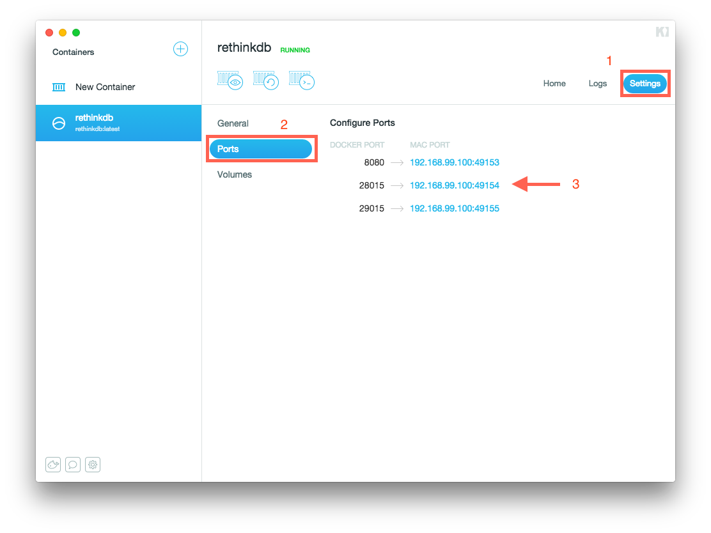

# 创建一个本地RethinkDB 数据库

在本文，你将了解到：

* 创建一个开发环境的RethinkDB容器。
* 克隆一个小的Node.js应用并写数据到RethinkDB。

## 在Kitematic上安装RethinkDB

首先，你如果你没有下载安装过，请点击[下载Kitematic并启动](Kitematic/install.md)。一旦打开，app应该长这个样子：

点击 *创建* 按钮列列举推荐的列表。这将下载和运行RethinkDB在几分钟内。一旦完成，你将有一个本地的RethinkDB运行在本地。

让我们开始使用它开发一个Node.js应用。现在，让我们了解RethinkDB监听的IP地址和端口。为了找到，点击*设置*页签，然后再点击*端口*。

你可以看到RethinkDB监听28015，容器在主机上映射IP 192.168.99.100和端口49154。这意味着你现在可以访问RethinkDB通过客户端驱动到192.168.99.100:49154即可。再次说明，IP地址可能对你来说是不同的。

## 保存Node.js应用的数据到RethinkDB上

现在，你将创建RethinkDB实例聊天应用运行在你本地OS X系统上，以便来测试你新的容器化数据库的驱动。

首先，你如果没有下载并安装Node.js，请点击[这里](http://nodejs.org/)。

> 说明：本示例需要安装Xcode。我们将使用某些依赖包来替换它。

在你的终端，键入：

	 $ export RDB_HOST=192.168.99.100 # replace with IP from above step
	 $ export RDB_PORT=49154 # replace with Port from above step
	 $ git clone https://github.com/rethinkdb/rethinkdb-example-nodejs-chat
	 $ cd rethinkdb-example-nodejs-chat
	 $ npm install
	 $ npm start

现在，点击你的浏览器访问http://localhost:8000。恭喜你，你成功在Kitematic上使用RethinkDB容器创建一个实时聊天应用了。愉快的编程！

