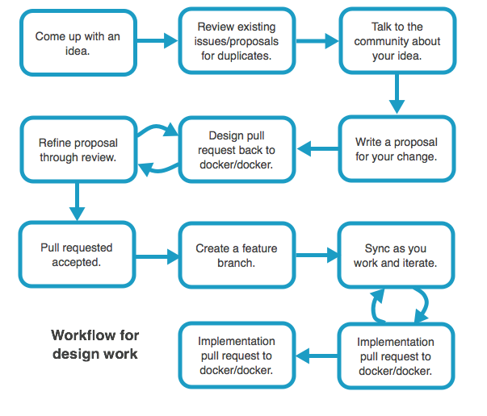

# 学习高级贡献 #

本节中，你将学到更多Docker的高级贡献，他们之所以高级是因为他们有更复杂的工作流程或者需要更多的编程经验。不要担心有多难，这是一个挑战你自己的好地方。

文中只是简单的叙述了如何高级贡献，你会看到大致的工作流程当我们并没有做过多的解释，你的目标应是了解整个的过程。

## 重构或清理建议 ##

重构或清理的建议意味着在不修改外部行为的情况下，改变Docker内部的结构，步骤如下：

1. fork `docker/docker`

2. 在特性分支中进行修改

3. 使用 master 同步并重写你的分支

4. 执行全部的测试套件

5. 通过一个pull请求（PR）来提交你的代码

请求的标题必须有如下的格式：

Cleanup：简介的标题

如果你的修改涉及到逻辑的变化，你必须在请求中作出说明

6. 参与到docker 的审查中知道被合并（merge）到master中

## 设计方案 ##

设计方案可以解决docker的某个问题或向docker添加某个功能，提交一个设计方案需要两个pull请求（PR），一个用来设计，一个用来实现。

值得注意的是：设计的pull请求和实现的pull请求都必须通过审核，换句话说，你有相当长的时间来实现你的方案，因为你可能要和其他人一起来完成你的设计。下面将提供详细的步骤：

1.  需要一个想法

想法通常来自于用户感受到产品工作的限制，所以，花点时间认真使用docker，而且是在不同的平台上使用，探索在不同的web应用上docker是如何工作的，去一些docker的社区，并了解一下其他用户产生的问题。

2. 审查现有的问题和建议，以确保没有其他用户提出了类似的想法。

设计方案都会在我们的[GitHub上的pull请求页面上](https://github.com/docker/docker/pulls?q=is%3Aopen+is%3Apr+label%3AProposal)

3. 向docker社区分享你的一些想法

我们有很多docker的[社区论坛](https://docs.docker.com/project/get-help/)，你可以在上面发表你的想法，并看看其他人的想法

4.  fork docker/docker 并将仓库克隆到你的主机

5.  在你要修改的地方创建一个markdown文件

比如：你想要重新设计守护进程，你就要在 daemon/ 文件夹中创建一个 markdown文件

6.  描述性地命名该文件，如 redesign-daemon-proposal.md

7.  写一份你更改建议的文件

这是一个markdown文件，它描述了你的idea，这个文件中应有如下的信息：

你为什么要修改这个或用了什么例子？

你的这个修改应满足怎样的要求？

使用了哪些方法来设计/实现了这个功能？

哪一个设计/实现方法你认为是最好的，为什么？

你的这个方案有哪些风险/限制？

有了以上信息你才有足够的理由来说服别人同意你的想法

8. 通过向 docker/docker 提出pull 请求来提交你的方案

标题必须是如下的格式：

Proposal:简洁明了的标题

请求的内容中应对你的修改做一个简明的总结，然后再写上“阅读这篇文章来查看详细的说明”。

9.    通过审查来优化你的方案

维护人员和社区回审查你的方案，你需要回答一些问题，有时候你还要向他们解释或捍卫你的提案，这对每个人来说都是一个互相学习的好机会

10.    pull请求被接受了！

你的请求也许会被拒绝，不是每一个idea都适合docker，我们假设一下你的方案被接受了。

11.   实现你的idea

实现的方法应该使用标准的方法：

fork docker/docker

创建特性分支

经常和master同步

你做的每一步都要测试，在你pull请求前做一个整体的测试

一旦你遇到了问题，你可以向论坛社区寻求帮助

12.    当你有了完整的实现步骤后，你就可以向 docker/docker 发出pull请求了

13.    审查遍历你的代码

如果你修改了很多地方，你可以期待更加严格的审查

14.    接受你的修改并合并到master中