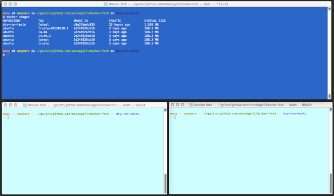
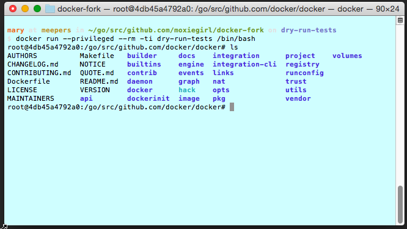
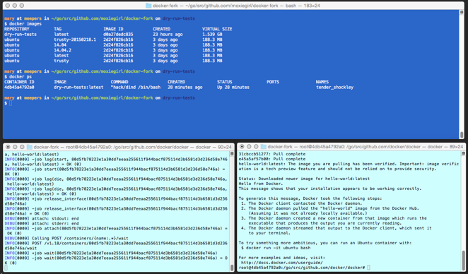

# 配置开发环境

本节中，你将会像docker核心团队那样来学习开发docker。在docker代码库的根目录中会有一个 Dockerfile 文件，这个文件定义了docker的开发环境，在dockerfile文件中列出了docker开发环境的依赖：系统类库和二进制文件，go 开发环境，go 的依赖等。

其实，docker 开发环境最终也是一个docker容器，你用docker 代码库的dockerfile文件创建一个docker镜像，用这个镜像运行一个docker容器，然后在这个容器中编写开发代码，就是利用这个容器来构建，测试及发布最新的docker 版本。

上一节中，我们已经fork 了docker项目，并创建了一个名为 dry-run-test 的分支，这一节，我们将在这个分子中做更多的事情。

## 清理Docker主机上的历史记录

无论是在docker客户端还是 boot2docker客户端上开发，开发者通常会运行docker最新的稳定版，所以更新之后，我们要清理docker主机上没有用的文件，比如停止的容器，没有使用的镜像，虽然清理不必要的文件不是必须的，但这是一个良好的习惯。清理步骤如下：

1. 检查电脑中的容器

	$ docker ps

你会看到如下类似的信息：

	CONTAINER  ID     IMAGE    COMMAND    CREATED    STATUS    PORTS      NAMES

说明你的docker主机中没有正在运行的容器，如果你有正在运行并没有用的容器，你可以用 docker  stop 和 docker  rm 命令先将容器停止再删除。

2. 检查电脑中是否有镜像文件

	$ docker images 

你会看到如下的信息：

	REPOSITORY        TAG        IMAGE  ID        CREATED         VIRTUAL SIZE

说明主机中已经没有任何镜像了，你的主机中可能会有一些镜像，如果这些镜像没有被使用，你可以用下面的方法来快速删除这些镜像：

$ docker rmi -f $(docker images -q -a -f dangling=true)

这条命令中，`docker images -q -a` 会显示所有镜像（`-a`）的id（`-q`），`-f dangling=true` 筛选出没有被使用的镜像，然后，`docker rmi -f` 会强制（-f）删除这些镜像，如果仅删除一个镜像，只需要使用这个命令：`docker rmi ID`  其中 ID就是镜像的id。

## 构建镜像

在上面的步骤完成之后，我们将来构建一个用户开发的镜像

1. 打开终端

如果是在Mac 上，请执行 boot2docker status 这个命令来确保Boot2Docker 服务是启动的，你应该执行 eval "$(boot2docker shellinit)" 这个命令来初始化你的shell环境

2. 进入fork 到本机的docker 项目的目录

	$ cd ~/repos/docker-fork

3. 验证一下你是否在 `dry-run-test` 分支下

	$ git checkout dry-run-test

4. 构建镜像

	$ docker build -t dry-run-test .

当执行 docker build 命令时会返回一些参考信息，第一次构建镜像时可能会花费比较长的时间。在用 Dockerfile构建镜像时，可能要去下载其他的资源或依赖镜像，当构建成功后会显示如下的信息：

	Successfully built 676815d59283

5. 再一次列出你的镜像

$ docker images

你会看到如下类似的信息：

	REPOSTITORY   TAG                   IMAGE  ID            CREATED                     VIRTUAL SIZE
	
	dry-run-test      latest                 663fbee70028      About a minute ago
	
	ubuntu              trusty                2d24f826cb16       2 days ago                  188.3 MB
	
	ubuntu           trusty-20150218.1   2d24f826cb16   2 days ago                  188.3 MB
	
	ubuntu             14.04                  2d24f826cb16       2 days ago                  188.3 MB
	
	ubuntu             14.04.2               2d24f826cb16       2 days ago                  188.3 MB
	
	ubuntu             latest                  2d24f826cb16       2 days ago                  188.3 MB

你会看到有 dry-run-test 这个镜像，同时也有一些 ubuntu 的镜像，这些镜像是在构建过程中创建的，这些是docker开发镜像的基础镜像，当你重新构建镜像时，又会重新使用这些基础镜像。

如果docker主机中存在这些基础镜像，会提高构建的效率。当你重新构建一个镜像时，docker会直接使用这些基础镜像，而不是从 Docker Hub 上重新下载。当然，如果 Docker Hub上有新的版本的话，就会从 Docker Hub上下载。

## 运行容器

现在，我们已经创建好了一个用于docker开发的镜像了，接下来我们利用这个镜像来运行一个容器。

1. 打开另外两个命令终端，现在桌面上应该有3个命令终端

Mac OSX 用户你要先执行 eval "$(boot2docker shellinit)"  这个命令在每个终端下

2. 用 dry-run-test 镜像运行一个容器

	$ docker run --privileged --rm -ti dry-run-test /bin/bash
	
	root@5f8630b873fe:/go/src/github.com/docker/docker#

-ti 表示运行一个交互的命令终端 `/bin/bash shell ，--privileged` 赋给容器使用内核特性和设备的权限，这个标志也允许你在一个容器中运行另一个容器，最后，--rm 表明当你退出容器时会自动删除这个容器。

在容器的 `/go/src/github.com/docker/docker` 这个目录中，会存在 dry-run-test 镜像的代码，试着检查本容器中的内容是否和`docker-fork` 中的一样

3. 查看容器的信息

查看 go 的版本

	root@31ed86e9ddcf:/go/src/github.com/docker/docker# go version
	
	go version go1.4.2 linux/amd64

同样的，执行 docker version ，但你会发现docker 命令找不到

	root@31ed86e9ddcf:/go/src/github.com/docker/docker# docker version
	
	bash: docker: command not found

没关系，下一步中将会解决

4. 在 `/go/src/github.com/docker/docker` 目录中使用 make.sh 脚本来生成 docker binary 

	root@5f8630b873fe:/go/src/github.com/docker/docker# hack/make.sh binary

在docker 开发容器中你可以仅使用 hack/make.sh 命令来创建一个 binary，在你的主机中，你将会使用 make 命令（之后会有更多的信息）

当你执行上述代码后，make.sh 脚本将会显示整个构建过程，当构建成功后，你会看到如下的构建信息：

	--->Making bundle: ubuntu (in bundles/1.5.0-dev/ubuntu)
	
	Createdpackage{:path=>"lxc-docker-1.5.0-dev_1.5.0~dev~git20150223.181106.0.1ab0d23_amd64.deb"}
	
	Createdpackage{:path=>"lxc-docker_1.5.0~dev~git20150223.181106.0.1ab0d23_amd64.deb"}

5. 列出 binary 目录中的所有内容

	root@5f8630b873fe:/go/src/github.com/docker/docker# ls bundles/1.5.0-dev/binary/
	
	docker  docker-1.5.0-dev  docker-1.5.0-dev.md5  docker-1.5.0-dev.sha256

6. 将 docker binary 文件复制到容器中的/usr/bin目录

	root@5f8630b873fe:/go/src/github.com/docker/docker#  cp bundles/1.5.0-dev/binary/docker /usr/bin

7. 现在，你可以在容器中检查docker的版本了

	root@5f8630b873fe:/go/src/github.com/docker/docker# docker --version
	
	Docker version 1.5.0-dev, build 6e728fb

8. 你会发现你现在的docker是一个开发版，这个版本号就在 docker-fork 代码库根目录的 VERSION 文件中。

在docker 容器中运行一个docker 守护进程

	root@5f8630b873fe:/go/src/github.com/docker/docker#  docker -dD

-dD 表明这个守护进程是以 debug模式运行的，当你在debug你的代码时，你会发现这个特别有用。

9. 现在使用另一个命令终端

10. 查看是否存在使用 dry-run-test 这个镜像并正在运行的容器

	$ docker ps
	
	CONTAINER ID      IMAGE         COMMAND    CREATED    STATUS    PORTS    NAMES
	
	474f07652525       dry-run-test:latest    "hack/dind /bin/bash     14 minutes ago    Up 14 minutes    tender_shockley

在本例中，你会看到一个叫 tender_shockley 的容器，而你的将会不同

11. 在另一个终端下，从docker 开发容器中启动另一个 shell 窗口

$ docker exec-it tender_shockley bash

现在，我们已经在不同的终端下从 docker 的开发容器启动了两个 shell窗口，一个终端是运行debug程序的，而另一个则显示bash 提示符的。

12. 在这个提示符下，运行一个 hello-world 容器来测试 docker 客户端

	root@9337c96e017a:/go/src/github.com/docker/docker#  docker run hello-world

你会看到镜像在加载并返回，同时，你可以看到通过调试程序发出的呼叫

        
## 使用你的源码重新启动容器

现在，你已经对"Docker inception"技术有点经验了：

*　使用docker代码库创建一个docker 镜像

*　使用镜像创建并运行一个docker开发容器

*　使用最新编译过的二进制文件运行一个docker守护进程

*　在开发容器中使用docker客户端运行一个 hello-world 容器

当你真正在开发代码的时候，你将要遍历代码的更改并在容器中构建，对于那样，你要将本地的代码库挂载到docker容器，接下来我们来试一下。

1. 先退出 BASH shells 然后停止运行的容器，你可以使用 docker ps 命令来查看容器是否已经停止，所有的终端都应该在本机的提示符下。

2. 在三个终端下随便选择一个终端，但要确保你是在 docker-fork 代码库中

	$ pwd
	
	/Users/mary/go/src/github.com/moxiegirl/docker-fork

3. 使用 dry-run-test 创建一个容器，但要把你现在的代码库挂载到容器的 /go 目录下面

	$  docker run --privileged --rm -ti -v `pwd`:/go/src/github.com/docker/docker dry-run-test /bin/bash

当你使用 pwd 时，docker会解析到你当前的位置

4. 在容器中列出 binary 目录

	root@074626fc4b43:/go/src/github.com/docker/docker# ls bundles/1.5.0-dev/binary
	
	ls: cannot access binary:No such file or directory

可以预料到 dry-run-test 并没有保留容器内所有的更改

5. 现在我们使用一个新的终端，并切换至docker-fork根目录

	$ cd ~/repos/docker-fork/

6. 使用 make 创建一个新的 binary

$ make BINDDIR=.binary

在Mac OS X系统中BINDDIR 是必须的，但在Linux命令行中也没有问题。像 make.sh 脚本文件这样的make命令，会显示它的进度，但执行成功后，它会显示新的 binary的位置。

7. 现在我们再来列出 binary 的目录

	root@074626fc4b43:/go/src/github.com/docker/docker# ls bundles/1.5.0-dev/binary
	
	docker  docker-1.5.0-dev  docker-1.5.0-dev.md5  docker-1.5.0-dev.sha256

现在我们可以在我们的docker开发容器中使用主机上编译好的binary 文件了

8. 重复你在上述过程中使用的步骤

* 在开发容器中使用 cp bundles/1.5.0-dev/binary/docker  /usr/bin命令复制binary文件

* 在容器中使用 -dD 命令来启动docker守护进程

* docker exec -it container_name bash  命令连接到运行的容器

* 容器中执行docker run hello-world 命令，在容器中创建并运行另一个容器

## 下一节

[运行一个测试程序并测试文档](test-and-docs.md)