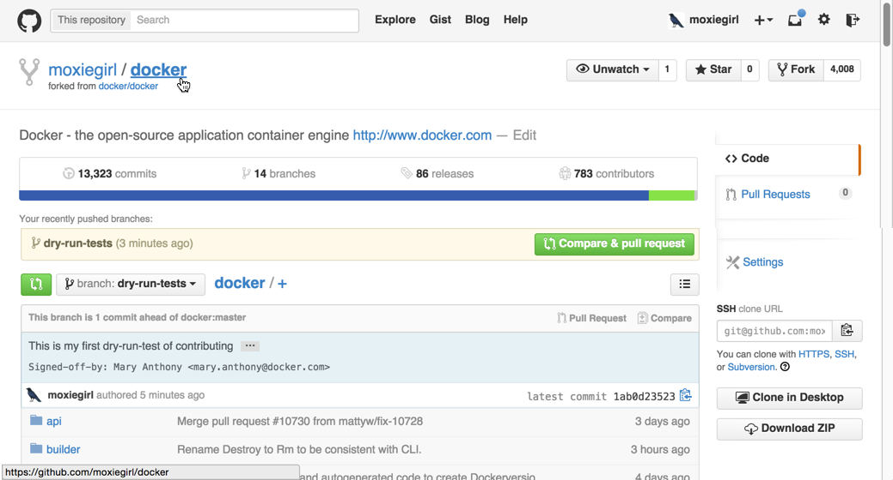

# 配置Git

本节将带你配置Git并创建一个代码仓库。

## Fork并clone Docker代码

在你贡献之前，你先要 fork docker的代码库，fork 操作会复制特定时间的代码库，Github会跟踪你从哪里fork的。

当你改完代码之后，你需要向原始的docker代码库做一个 pull request 的请求。如果你对这个工作流程不熟，不用担心，在这节中会一步一步的教你。

fork 和 clone：

1. 打开浏览器并登录Github

2. 找到 docker/docker 这个代码库

3. 点击右上方的“fork”按钮

这时Github会fork代码到你的账号中，你会在你的账号中找到 `YOUR_ACCOUNT/docker` 这样的代码库。

4. 在Github中复制你刚才 fork 的代码库的 clone 地址

Github允许你 clone 时使用 HTTPS 或 SSH，你可以使用 git 命令或类似 Subversion 这样的客户端来 clone 代码库。

[copy_url.png](../Images/copy_url.png)

在docker指南中假定你使用的是 HTTPS协议 和 git 命令行，如果你对 SSH或其他工具比较熟悉的话，也不介意你使用，不过方法可能会有稍许的不同。

5. 在主机中打开命令窗口并切换到你的Home目录

	$ cd ~

在Windows上,你将工作在你的Boot2Docker窗体程序上，替代的是使用Powershell或者cmd窗体程序。

1. 创建一个 repos 目录

	$ mkdir repos

2. 进入repos目录

	$ cd repos

3. 将你刚才fork的代码库clone到你的主机中名为 docker-fork 的代码库中

	$ git clone https://github.com/moxiegirl/docker.git docker-fork

之所以将本地的代码库取名为 docker-fork，是因为下文中还要用到，当然一些有经验的程序员并不会去刻意的修改它的名字。

4. 进入` docker-fork` 目录

	$ cd docker-fork

现在花一点时间来熟悉代码库中的内容。

## 设置你的签证和远程分支

当你向docker贡献时，你必须同意[Developer Certificate of Origin](http://developercertificate.org/)，当你使用如下的git命令时就代表你已经同意了：

	Signed-off-by:PatSmith<pat.smith@email.com>

你要在Git中配置你的用户名和email来创建一个数字签名，你可以将它们设置成全域的或者仅在 docker-fork 中有效。你必须使用真实姓名，我们不接受匿名或假名贡献。

当你修改代码时，如果你想要和 docker/docker 这个代码可保持同步，为了使同步更简单，你要添加一个 叫“upstream”的 remote 版本并指向docker/docker，remote版本只是网络上的另一个版本。

配置你的用户名，email，并添加一个 remote 版本：

1. 进入 docker-fork 目录

	 $ cd docker-fork

2. 设置用户名

	$ git config --local user.name "FirstName, LastName"

3. 设置email

	$ git config --local user.email "emailname@mycompany.com"

4. 设置remote，用于和 docker代码库同步

	$ git remote add upstream https://github.com/docker/docker.git

5. 最后查看git配置

	$ git config --local -l

	core.repositoryformatversion=0
	
	core.filemode=true
	
	core.bare=false
	
	core.logallrefupdates=true
	
	remote.origin.url=https://github.com/moxiegirl/docker.git
	
	remote.origin.fetch=+refs/heads/*:refs/remotes/origin/*
	
	branch.master.remote=origin
	
	branch.master.merge=refs/heads/master
	
	user.name=Mary Anthony
	
	user.email=mary@docker.com
	
	remote.upstream.url=https://github.com/docker/docker.git
	
	remote.upstream.fetch=+refs/heads/*:refs/remotes/upstream/*

只列出remote用到的配置信息：

	$ git remote -v 
	
	origin  https://github.com/moxiegirl/docker.git (fetch)
	
	origin  https://github.com/moxiegirl/docker.git (push)
	
	upstream    https://github.com/docker/docker.git (fetch)
	
	upstream    https://github.com/docker/docker.git (push)

## 创建并push一个分支

你修改的代码只是在docker代码库的一个分支上，分支的名称应该反应出你做了哪些工作，本节中，你将会创建一个分支，修改代码，然后将它推送到你fork的代码库中。

这个分支仅适用于本节中测试你的配置，我们给分支取名为dry-run-test，创建一个分支：

1. 进入docker-fork目录

	$ cd docker-fork

2. 创建一个 dry-run-test 分支

	$ git checkout -b dry-run-test

    **此命令创建分支并切换到此代码库

3. 检查你是否在新建的分支中

		$ git branch
	
		* dry-run-test  
	
		master

**在当前分支中会有一个星号

4.创建 TEST.md 文件

	$ touch TEST.md

5. 在编辑文件并添加你的email和路径

6. 保存并退出

7. 检查你的分支的状态

	$ git status 
	
	On branch dry-run-test
	
	Untracked files:
	
	    (use"git add <file>..." to include in what will be committed)    
	
	        TEST.md
	
	nothing added to commit but untracked files present (use"git add" to track)

8. 将文件添加到你的git中

$ git add TEST.md

9. 签名并提交你的更改

	$ git -s -m "Making a dry run test."
	
	[dry-run-test 6e728fb]Making a dry run test
	
	1 file changed,1 insertion(+)
	
	  create mode 100644 TEST.md

提交的信息应该含有一个不能超过50个字符的摘要，另外你也可以在摘要下面加入更详细的解释说明，不过这中间应该空一行。

10. 将你的修改推送到 Github

	$ git push --set-upstream origin dry-run-test
	
	Username for 'https://github.com':  moxiegirl
	
	Password for 'https://moxiegirl@github.com':

Git将提示你输入Github的用户名和密码，然后，会输出以下结果：

	Counting objects: 13, done.
	
	Compressing objects: 100% (2/2), done.
	
	Writing objects: 100% (3/3), 320 bytes | 0 bytes/s, done.
	
	Total 3 (delta 1), reused 0 (delta 0)
	
	To https://github.com/moxiegirl/docker.git
	
	 *[new branch]      dry-run-test -> dry-run-test
	
	Branch dry-run-test set up to track remote branch dry-run-test from origin.

11. 现在你可以访问你的Github

12. 进入你fork的docker项目中

13. 检查一下 dry-run-test 这个分支是否存在

## 下一步

恭喜，你已经完成了所有的配置工作。下一节，会知道[如何设置并使用docker开发容器](set-up-dev-env.md)。